

Nothing
---------------------------------
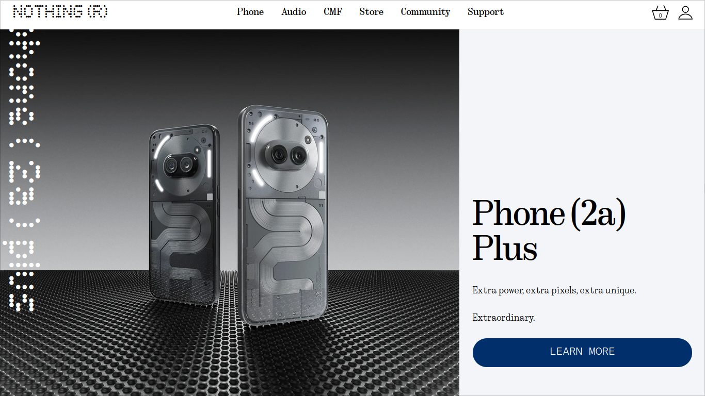

  
  

## Typeface

| Ndot-55                                          |
| ------------------------------------------------ |
| 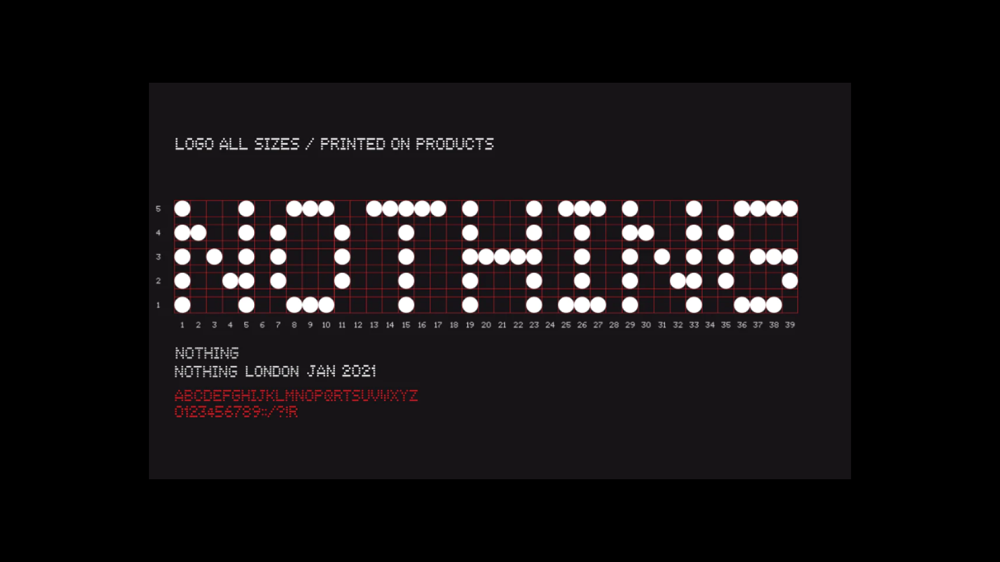                    |
| 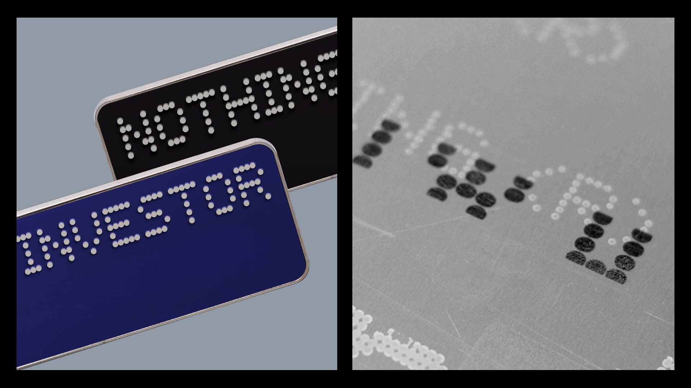                    |
| 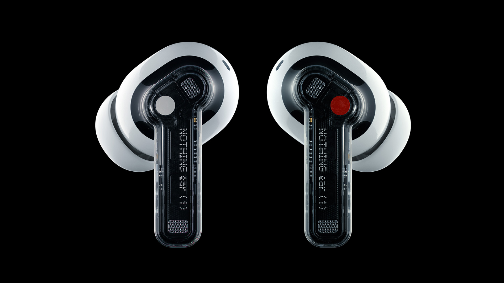                    |
| 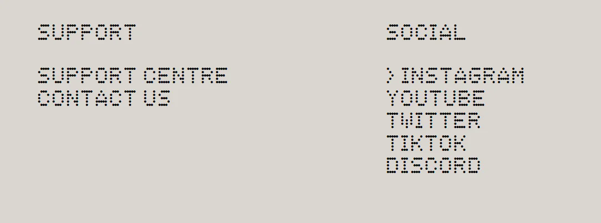                 |
|                       |

| Ndot-57                                          |
| ------------------------------------------------ |
| 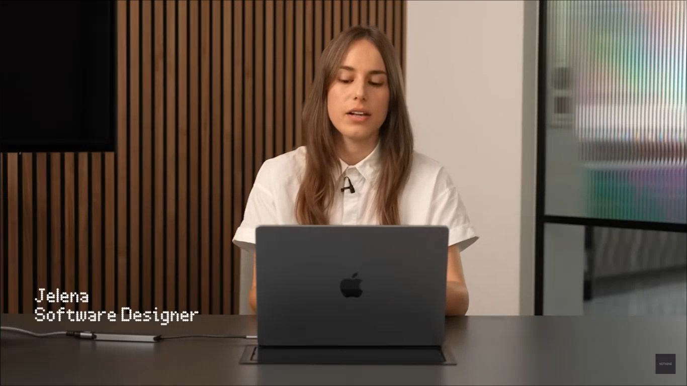                    |
| 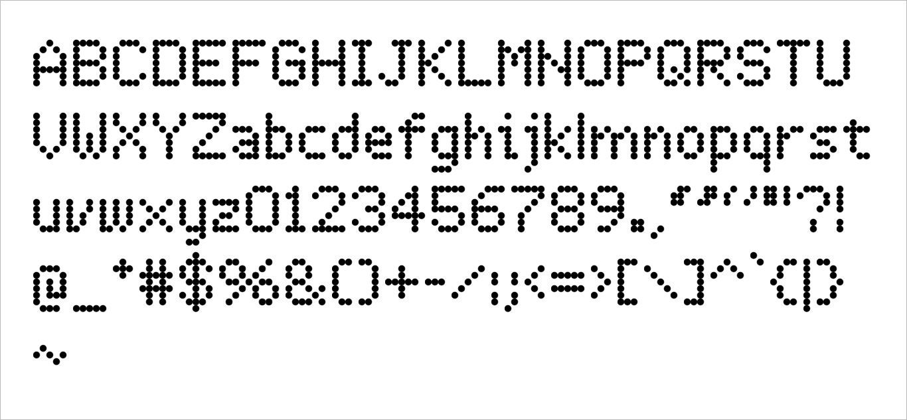                |

| NType-82                                         |
| ------------------------------------------------ |
| 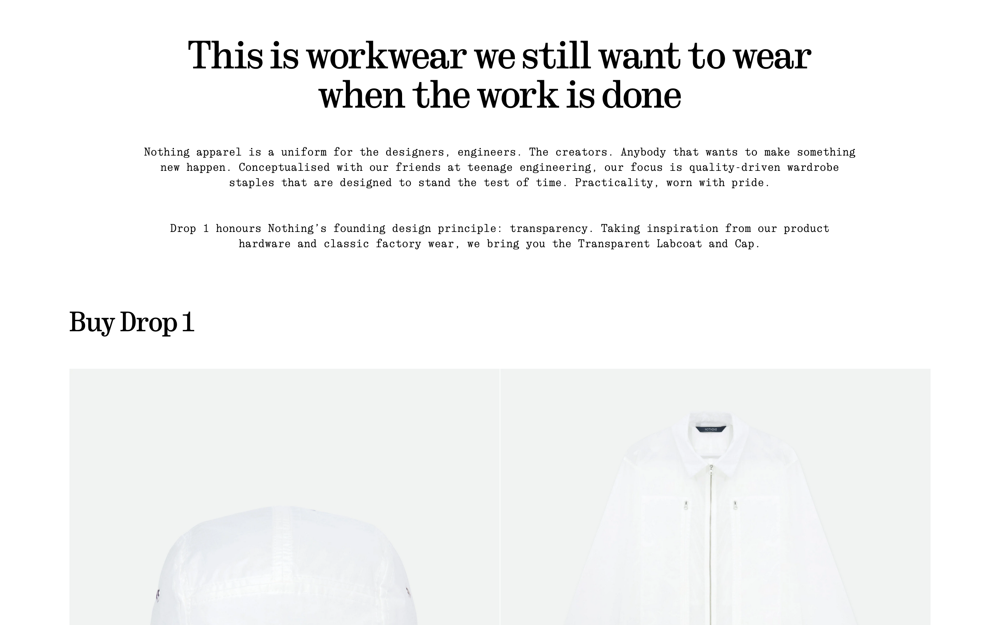                     |

| Lettera Mono LL                                  |
| ------------------------------------------------ |
| 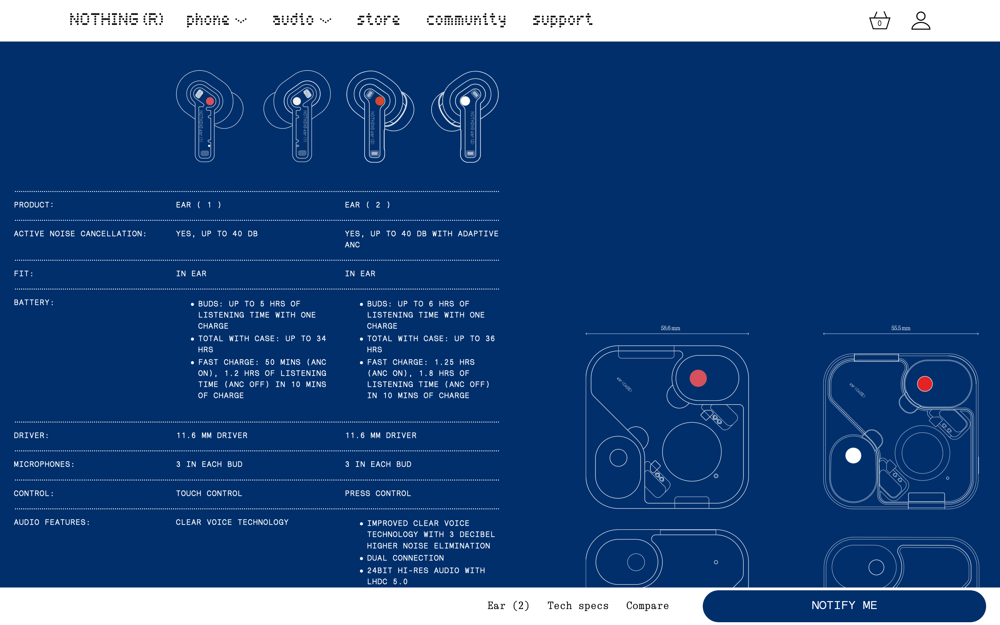      |

| Space Mono & Space Grotesk                       |
| ------------------------------------------------ |
| 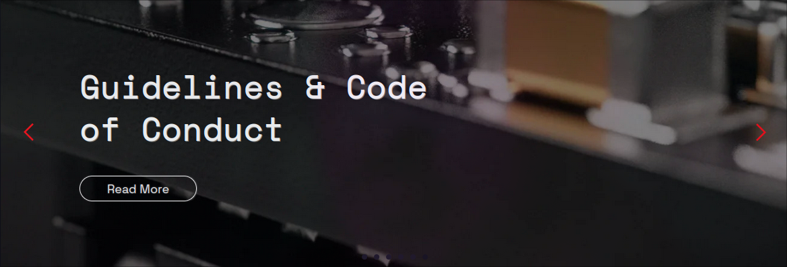                  |
|                |

## Ndot-55 vs Ndot-57

Both are pretty much similar with only a few minor differences.

As you can see, Ndot-57 has much tighter dots compare to Ndot-55. It's also has some tweaks so it could be more readable.

You can spot the differences on lowercase letters such as _a, e, f,_ and _s_.

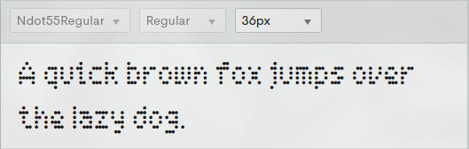              
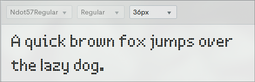

## Credits
- [NOTHING](https://nothing.tech) Tech. All Rights Reserved.
